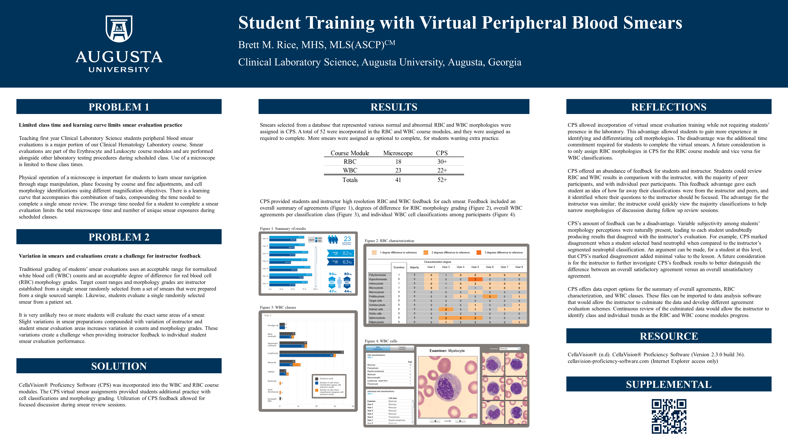

## Supplementals

### Poster Narration

[Full narration](https://youtu.be/w-L-oWvn_UY), ~17 minutes  or select video pieces:
* [Poster and project introduction](https://youtu.be/w-L-oWvn_UY), ~5 minutes duration
* [Using CPS](https://youtu.be/w-L-oWvn_UY?t=302),  ~7 minutes duration
* [CPS Feedback Examples](https://youtu.be/w-L-oWvn_UY?t=725),  ~5 minutes duration
  
### CPS Demo Logins 

Link: [Cellavision Proficiency Software](https://login.cellavision-proficiency-software.com)
 * 02-22-2021 Update - CPS can now be accessed from Firefox and Chrome

Contact me for new and unused login
  
Association | Username | Password
----------- | :-----------: | :-----------:
Demo1 | a8ff1568-3ed | 569f9wRY
Demo2 | 3bff2c27-0e2 | nWz86c5N
Demo3 | 18bd73a4-e0a | 22tA866G
Demo4 | bcf52184-165 | er6nL98Y
Demo5 | 7cf058e5-223 | 837Qq8QF
Demo6 | 60f44067-fef | 7H69c42L
Demo7 | 2ff5a206-a1d | j3865E4C
Demo8 | 42337a87-e75 | DJ3x387S
Demo9 | d0eb10a0-b2e | dAKq6dFR
Demo10 | 7f612eae-c1a | wR26v93H

### Data Export File Examples

Slide 1

  
 * [Summary of results](<Exports/S1_Exports/Summary_of_resutls.csv>)  
 * [WBC classes](<Exports/S1_Exports/WBC_classes.csv>)  
 * [RBC characterization](<Exports/S1_Exports/RBC_characterization.csv>)  

  

Slide 2

  
 * [Summary of results](<Exports/S2 Exports/Summary_of_resutls.csv>)
 * [WBC classes](<Exports/S2 Exports/WBC_classes.csv>)
 * [RBC characterization](<Exports/S2 Exports/RBC_characterization.csv>)

  

Slide 3

  
 * [Summary of results](<Exports/S3 Exports/Summary_of_resutls.csv>)
 * [WBC classes](<Exports/S3 Exports/WBC_classes.csv>)
 * [RBC characterization](<Exports/S3 Exports/RBC_characterization.csv>)

 
### Contact Information

Business Card

  

